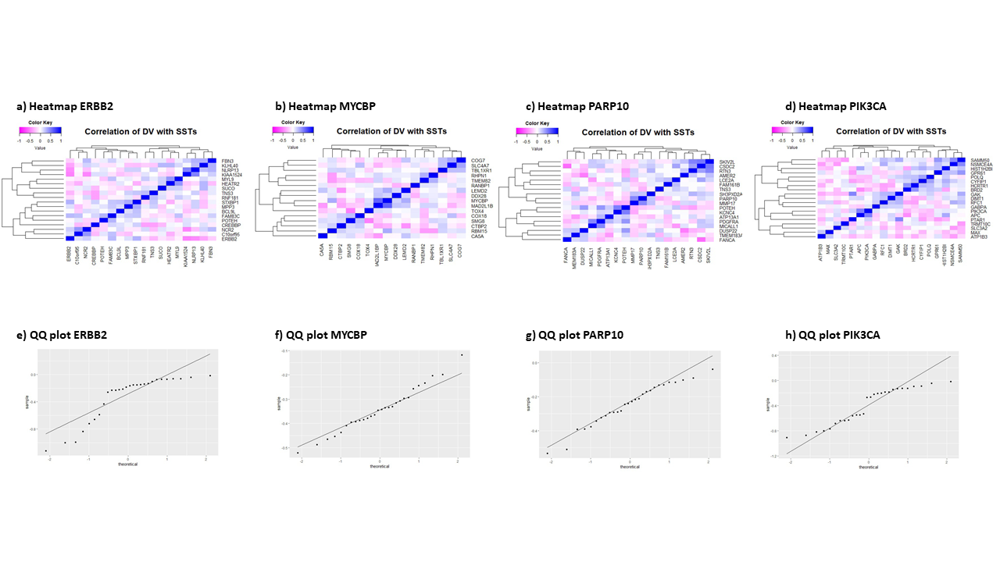
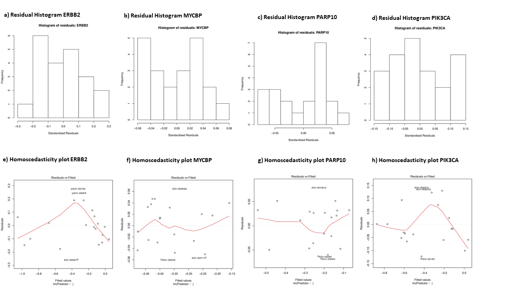

<style type="text/css">

body{ /* Normal  */
    font-size: 16px;
    font-family: "Segoe UI", Frutiger;
    text-align: justify
  }
td {  /* Table  */
  font-size: 12px;
}
h1.title {
  font-size: 40px;
  font-weight: 400
  color: #013644;
  font: "Segoe UI", Frutiger;
}
h1 { /* Header 1 */
  font-size: 28px;
  color: #fba92e;
}
h2 { /* Header 2 */
  font-size: 22px;
  color: #158597;
}
h3 { /* Header 3 */
  font-size: 18px;
  color: #158597;
}
code.r{ /* Code block */
    font-size: 14px;
}
pre { /* Code block - determines code spacing between lines */
    font-size: 14px;
}

<blockquote class="blockquote-reverse">
  <p>Lorem ipsum dolor sit amet, consectetur adipiscing elit. Integer posuere erat a ante.</p>
  <small>Someone famous in <cite title="Source Title">Source Title</cite></small>
</blockquote>

<table class="table table-striped table-hover ">
  <thead>
    <tr>
      <th>#</th>
      <th>Column heading</th>
      <th>Column heading</th>
      <th>Column heading</th>
    </tr>
  </thead>
  <tbody>
    <tr>
      <td>1</td>
      <td>Column content</td>
      <td>Column content</td>
      <td>Column content</td>
    </tr>
    </tbody>
</style>

```{r setup, include=FALSE}
knitr::opts_chunk$set(echo = TRUE, error = FALSE)
library(extrafont)
font_import()
```
# Introduction

## Breast Cancer: a challenging disease
> "The heterogeneity of breast cancers makes them both a fascinating and challenging solid tumor to diagnose and treat." 
>
> <small>Raj Kumar (2016) in <cite title="Source Title">A novel therapeutic target for triple negative breast cancer</cite></small>

Breast cancer (BC) is currently known as one of the most prevalent and deathly malignant tumor types, resulting in more than 600,000 deaths worldwide in 2017 (GBD 2017). While in Germany 70,000 new cases are reported annually (Barnes, Kraywinkel et al. 2016), breast cancer makes up ~30% of all reported cases of tumor diseases (Robert-Koch-Institut 2017). Over the past 27 years the prevalence of this tumor surged by one sixth in percentage of world population, calling for accelerated research on possible therapy options. 
While in the past decades breast cancer therapy has already evolved, reducing the age standardized death rate by one third, from 15.10 to  only 10.00 in western europe (GBD 2017), the necessity to find effective prevention methods remains (Sledge et al. 2014). A promising method is an computerbased approach taking identifying genetic interactions which can be exploited therapeutically. This stratetgy is also pursued by the project at hand.

## Driver Mutations: the driving force in tumorigenesis

Driver mutations (DV) are the key promoters of tumorigenesis leading to new functions and cell states of affected tissues (Stratton, 2009). Thus, the acquisition of driver mutations is essential for tumour initiation, transformation as well as progression and metastasis (Hanahan, 2000). According to Bert Vogelstein three mutations in genes displaying a crucial function in cell proliferation, DNA integrity and cellular motility are enough to drive a normal cell into aberrant growth and malignancy:

> "Focusing on driver-gene mutations and the pathways they control has rendered complex cancer-genome landscapes intelligible. In solid tumors of adults, alterations in as few as three driver genes appear to suffice for a cell to evolve into an advanced cancer." 
>
> <small>Bert Vogelstein in <cite title="Source Title">The Path to Cancer - Three Strikes and You're Out</cite></small>

These DVs comprise both gain-of-function mutations in (proto-)oncogenes which usually promote cell proliferation and loss-of-function mutations in tumour suppressor genes which usually decelerate the cell cycle as well as genes involved in DNA repair and proofreading (Anderson, 1992; Lee, 2010). Thereby, the cell acquires indispensable properties in tumorigenesis such as immortality, continous proliferation, immune and apoptosis resistance and the ability to promote angiogenesis (Hanahan, 2000). Examples for prominent oncogenes are k-ras and b-raf, both encoding kinases, regulating a complex network of proteins involved in cellular growth when bound to ATP or GTP, respectively. On the other hand, the most illustrious tumour suppressor gene is p53 whose physiological role is to induce cell senescence and apoptosis in case of DNA damage, a condition often encountered in cancer cells (Tsilimigras, 2018; Lee, 2010).

Due to their essential role in tumour progression DVs are predisposed targets in novel approaches in cancer therapy (Nussinov, 2019). For instance an antibody against HER2 (trastuzumab), which is an oncogene promoting cell growth while inhibiting apotosis, launched in 1998 was proven to reduce the recurrence rate by 50% and mortality by 30% (Maximiano, 2016). However, targeting genes or gene products involved in vital cellular processes remains a major challenge as healthy cells expressing the same genes are often affected as well (Lacouture, 2018). As therapies tailored to the molecular phenotype of the tumour achieved greater successes than conventional strategies, such as chemotherapy and irradiation, scientists now focus on identifying other molecular targets with a negligible effect on healthy tissues.  

## Second-site targets: secret co-operators in tumorigenesis

Driver mutations are not the only genetic factors involved in cancer development. Moreover, tumorigenesis derives from a complex genetic programme comprising several minor and major alterations in gene expression patterns as well as protein regulation. As these factors act synergistically in promoting tumour growth disturbing their interaction might provide another method of inhibiting cancer proliferation (Ashworth, 2011). 

The considered factors supporting the effect of driver mutations are often referred to as second-site targets (SSTs, also called "landscapers") as they do not necessarily confer a growth advantage to the tumour when mutated alone but by genetic interaction with other mutations. Thus, SSTs constitute promising targets in cancer therapy as they are meant to have a less significant effect on the viability of healthy cells because they do not display central regulatory functions (Ashworth, 2011). However, identification of these secret co-operators demands the analysis of several parameters reflecting their relevance and function in proliferation such as RNAseq data, data from gene knockouts and mutational analyses (Rauscher, 2018; Benstead-Hume, 2017; Magen, 2018).  


```{r SSTs, eval=TRUE, echo=FALSE, fig.cap="Concept of SSTs", out.width = '100%', fig.align = "center"}
knitr::include_graphics("Concept_of_SSTs.png")
```


# Project outline

The aim of this project is to answer the central question: 

> Which __second-site targets__ interact genetically with __driver mutations__ to promote cell viability and proliferation in breast cell cancers?

To begin with possible driver mutations from literature research were selected based on the following three characteristics:

  1. overexpressed in breast cancer
  2. observed in a relevant percentage of clinical cases
  3. part of processes/pathways of tumorgenesis
  
Finally, we selected:

Gene Name | Overexpression rate | Role in Tumorgenesis                   | Sources                                                     |
----------|---------------------|----------------------------------------|-------------------------------------------------------------|
CCND      | ~ 50%               |Cell cycle regulator                    |(Arnold and Papanikolaou 2005)                               |
ERBB2     | ~ 30%               |Encodes endothelial growth factor       |(Slamon, Godolphin et al. 1989)                              |
MYC       | ~ 30 - 50%          |Cell cycle and apoptosis regulator      |(Gabay, Li et al. , Xu, Chen et al. 2010)                    |
PARP10      | ~ 45%               |Regulates differentiation/proliferation |(Siraj, Pratheeshkumar et al. 2018)                          |
PIK3CA    | ~ 30 - 48%          |Interaction with AKT and mTOR pathway   |(Aleskandarany, Rakha et al. 2010, Shimoi, Hamada et al.2018)|

```{r driver mutations, eval=TRUE, echo=FALSE, fig.cap="Possible_Driver_Mutations", out.width = '100%', fig.align = "center"}
knitr::include_graphics("Possible_Driver_Mutations.png")
```

In the following project the CERES and expression scores of these driver mutations will be analysed together with those of the remaining mutated genes to identify possible genetic interactions marking them as SSTs.

# Methods

## Data cleanup and exploration

At the beginning of the analysis the data needs to be loaded:

```{r eval=FALSE, include = FALSE}
#Installation of required packages
install.packages("reshape")
install.packages("wesanderson")
install.packages("tidyverse")
install.packages("factoextra")
install.packages("RColorBrewer")
install.packages("gplots")
install.packages("data.table")
install.packages("rmarkdown")
install.packages("ggpubr")
install.packages('extrafont')
install.packages("devtools")
install.packages("captioner")
```
```{r eval=FALSE, include = FALSE}
#Importing libraries
library(ggplot2)
library(reshape2)
library(data.table)
library(cluster)
library(caTools) 
library(tidyverse)
library(factoextra)
library(wesanderson)
library(RColorBrewer)
library(gplots)
library(rmarkdown)
library(ggpubr)
library(extrafont)
library(devtools)
library(captioner)
```

```{r eval=FALSE}
#Setting a sys-path
root.dir = dirname(rstudioapi::getSourceEditorContext()$path)

#Importing the data
data = readRDS(paste0(root.dir, "/DepMap19Q1_allData.RDS")) #Read in the data 
```

```{r include=FALSE}
#Importing libraries
library(ggplot2)
library(reshape2)
library(data.table)
library(cluster)
library(caTools) 
library(tidyverse)
library(factoextra)
library(wesanderson)
library(RColorBrewer)
library(gplots)
library(rmarkdown)
library(extrafont)
library(devtools)
library(captioner)

font_import()
```

```{r Lisa, include=FALSE, eval = FALSE}
data = readRDS("C:/Users/lisa-/Desktop/Studium/4. FS/Bioinfo/DepMap19Q1_allData.RDS")
root.dir = "C:/Users/lisa-/Desktop/Studium/4. FS/Bioinfo/project-01-group-04"
```

```{r Salome, include=FALSE, eval=FALSE}
data = readRDS("C:/Users/Salome/Documents/4.FS/Bioinfo/DepMap19Q1_allData.RDS")
root.dir = "C:/Users/Salome/Documents/4.FS/Bioinfo/Github/project-01-group-04"
```

```{r Lennart, include = FALSE, eval=FALSE}
data = readRDS("L:/UNI/4.FS/BioStat/DepMap19Q1_allData.RDS")
root.dir = "C:/Users/ole-l/Documents/GitHub/project-01-group-04"
```

```{r Elias, include = FALSE, eval= TRUE}
data = readRDS("C:/Users/Elias/Documents/Uni/4. FS/Bioinfo/DepMap19Q1_allData.RDS")
root.dir = "C:/Users/Elias/Documents/GitHub/project-01-group-04"
```

We had a look at the given data structure.  

```{r include=FALSE}
length(data) #Get some information about the data (the dimensions here)
lapply(data, dim) #Get an impression on the data
#View(data$mutation) #Closer look because data$mutation returns NULL in the command above
lapply(data, function(a) head(a)) #Look at the data 
```

The dataset used contains six smaller datasets. Five of them are large data frames while the sixth (mutation data) is a list of data frames. For the extraction of this sixth variable we first separated it as a list from the others, which was easier to handle.

```{r}
#Extract the mutation data
mut <- data$mutation #Pick the mutation data (list not dataframe, needs to be treated separately)
'%!in%' <- function(x,y)!('%in%'(x,y)) #Define an operator that will only pick dat NOT defined in the list; 
dt_new <- lapply(which(names(data) %!in% "mutation"), function(a) data[[a]]) #Extract only non-mutation data
names(dt_new) <- names(data)[which(names(data) %!in% "mutation")] #Rename the data with the original names
length(dt_new) #Look if it worked (now dim is 5 and NOT 6 (because mutation was removed))
sample_case = c("Breast Cancer") #Gives us the opportunity to analyse other groups of cells
samples = data$annotation$DepMap_ID[which(data$annotation$Primary.Disease == sample_case)]
ids = which(names(mut) %in% samples)
dat = lapply(ids, function(a) mut[[a]])
```

We observe a large variety of tumor diseases being recorded by this dataset. Because we want to focus on breast cancer, we will generate data frames only containing cell lines refering to this specific type of tumor. For purposes of simplification, the columns were renamed to the appropriate tumor disease. Afterwards, the dataframe could be subsetted easily in breast cancer dataframes.

```{r warning=FALSE, include=TRUE}
#Changing colnames to specific type of tumor:
pdata <- lapply(1:(length(dt_new)-1), function(a) {
  dat_picker <- dt_new[[a]] #Pick one file at each iteration 
  col_names <- colnames(dat_picker) #Extract the original column names
  annotation_new <- data$annotation[which(col_names %in% data$annotation$DepMap_ID),4] #Get sample names in the order of the col_names list
  colnames(dat_picker) = annotation_new #rename the columns
  return(dat_picker)
})
names(pdata) <- names(data)[which(names(data) %!in% c("mutation", "annotation"))] #Rename the data
lapply(pdata, dim) #Look if the renaming worked

#Generating 4 dataframes, containing just breast cancer cell lines (BCCL)
BCCL_kd.ceres = pdata$kd.ceres[,which(colnames(pdata$kd.ceres) == sample_case)]
BCCL_Expression = pdata$expression[,which(colnames(pdata$expression) == sample_case)]
colnames(BCCL_Expression) <- samples #IDs as colnames are needed later
BCCL_Mutation = lapply(ids, function(a) mut[[a]])
names(BCCL_Mutation) = samples #IDs as names are needed later
BCCL_Annotation <- subset(data$annotation, Primary.Disease == sample_case)
tPatients_ID <- t(BCCL_Annotation[1]) #Create a vector of patientIDs useful for the MutImpact Matrix
```

### Exploring gene expression patterns 

The next step was to undertake some broad data analysis in order to get a feeling for the data distribution. 
We made a heatmap of expression values as well as CERES scores and found a diverse and unordered expression of genes troughout the 28 breast cancer cell lines. Within the CERES scores a group of genes showed a clear negative effect on cell viability. This group is suggested to be so called "housekeeping-genes", genes fulfilling the essential roles in the cell cycle. All the other genes showed a large variety across the cell lines, suggesting a computer based approach to be useful to find patterns in data. To make sure that all cell lines can be used, cell line values were analysed as whole cell. This was to prevent a whole cell line having a completely different expression or CERES picture. The boxplot, figure 2, below proves, this not to be the case. 

```{r warning = FALSE, echo=TRUE, fig.align= "center", fig.cap="_Fig. 1_ Heatmap of all BCCL CERES scores", eval= TRUE}
#Create a heatmap for all Genes and their CERES score
CERES50 <- as.matrix(BCCL_kd.ceres[c(1:nrow(BCCL_kd.ceres)),c(1:ncol(BCCL_kd.ceres))])
col <- colorRampPalette(c("seagreen3", "white", "red2"))(n = 1000) #Defining the colours for the heatmap
CERESHeatmap <- heatmap.2(CERES50, scale = "none", col = col, 
          trace = "none", density.info = "none", dendrogram = c("none"), labRow = FALSE, labCol = FALSE, main = "CERES scores of all BCCLs", xlab = "Breast cancer cell lines (BCCL)", ylab = "Genes, ordered by hierarchical clustering")
```

```{r warning = FALSE, echo=TRUE, fig.align= "center", fig.cap="_Fig. 2_ General gene expression in all 28 BCCLs"}
#Expanding the colourpalette to 28
nb.cols <- 28 
newcolours <- colorRampPalette(brewer.pal(8, "Paired")) (nb.cols)
#Plotting gene expression of all 28 BCCLs
GeneralExp <- BCCL_Expression[c(1:28),]
GenExmelt= melt(GeneralExp)
GeneralExp_boxplot = ggplot(GenExmelt, aes(x = variable, y = value)) +
     geom_boxplot(aes(fill=variable), outlier.alpha = 0.7,
                outlier.colour = "grey", outlier.shape = 20, outlier.size = 2) +
     labs(title = 'General expression in all 28 BCCLs', x = 'Breast cancer cell lines', y = 'Expression [TPM]') +
     theme_minimal() +
     geom_jitter(width = 0.15) +
     scale_fill_manual(values = newcolours) +
     theme(legend.position ='none',
           plot.title = element_text(hjust = 0.4),
           axis.text.x = element_blank(),
           legend.title= element_blank(),
           axis.title.x = element_text(),
           strip.text.y = element_text(angle = 0))
GeneralExp_boxplot
```

An issue was the very low level of expression of most genes, seen in the diagram above. In this phase of the project it was open if a second site target will have a high expression in every case. 
Next, boxplots of expression values for DV suggested by literature were generated. These boxplots present the different roles of genes in cell ending up in various expression values. 


```{r warning = FALSE, echo=TRUE, fig.align= "center", fig.cap="_Fig. 3_ Expression values of 12 selected driver mutations"}
GOI_Exp_lit <- BCCL_Expression[c("MYC", "PTEN", "TP53", "PIK3CA", "GATA3", "BRCA1", "BRCA2", "RB1", "GANAB", "PARP10", "CCND1", "ERBB2"),]
Exp_lit_driver_mut= melt(GOI_Exp_lit)
Exp_lit_driver_mut$variable=rep(c("MYC", "PTEN", "TP53", "PIK3CA", "GATA3", "BRCA1", "BRCA2", "RB1", "GANAB","PARP10", "CCND1", "ERBB2"), ncol(GOI_Exp_lit))

Exp_lit_boxplot = ggplot(Exp_lit_driver_mut, aes(x = variable, y = value)) +
     geom_boxplot(aes(fill=variable), outlier.alpha = 0.7,
                  outlier.colour = "grey", outlier.shape = 20, outlier.size = 2) +
     labs(title = 'Expression values of driver mutations, derived from literature', x = 'The eleven most prevalent driver mutations in BC', y = 'Expression [TPM]') +
     theme_minimal() +
     geom_jitter(width = 0.2) +
     scale_fill_brewer(palette = "Paired") +
     theme(legend.position ='none',
           plot.title = element_text(hjust = 0.4),
           axis.text.x = element_text(angle = 0, vjust = 0, hjust=0.5),
           legend.title= element_blank(),
           axis.title.x = element_blank(),
           strip.text.y = element_text(angle = 0))

Exp_lit_boxplot
```

Some of these genes were not followed up further due to being known as tumor suppressor genes (e.g. RB1, TP53). This was because our approach opts for targets reducing cell viability after a knockdown. A knockdown of a tumor suppressor gene, even if it is mutated, will rarely have a negative effect on cell viability. This makes genes associated with tumor suppressor genes useless for an inhibitory drug and therefore not appropriate for our analysis. 

### Generation of the mutImpact matrix

Every mutation has an impact on cell viability. In our analysis we have to distinguish not only between single mutations, we also have to evaluate different mutations in our cell lines "working together" and making every cell line different in its characteristics. In order to gain an overview of these characteristics, we will generate a matrix, showing the effect on viability, caused by a single mutation, in every cell line. The generated matrix will be called `mutImpact` matrix.

Therefore, the BCCL_kd.ceres matrix containing CERES scores for all genes in breast cancer cell lines was used as a template and the cell line IDs were added as column names creating a pre_mutImpact matrix. An empty matrix was generated comprising 17634 rows and 28 columns matching the number of genes per cell line and the number of breast cancer cell lines, respectively. 

Subsequently, CERES scores of genes, which were not mutated in a given cell line, were replaced with `NA` by implementing an "if statement". This statement included the enquiry whether the gene ID is present in the list of mutated genes of a considered cell line and in case the condition was met the CERES score was maintained. If `FALSE` was returned, the CERES score of the gene was replaced with `NA` for the considered cell line.

```{r, warning=FALSE}

#Generate pre_mutImpact matrix containing all CERES values and with IDs as column names 
pre_mutImpact <- BCCL_kd.ceres
colnames(pre_mutImpact)<-tPatients_ID

#Generate empty mutImpact matrix
mutImpact <- matrix(, nrow = 17634, ncol = 28)
colnames(mutImpact)<-colnames(pre_mutImpact)
rownames(mutImpact)<-rownames(pre_mutImpact)

#Fill mutImpact matrix with values
for (j in 1:ncol(pre_mutImpact)){
  lineID <- colnames(pre_mutImpact)[j] #Select a column-name = cell line
  for (i in 1:nrow(pre_mutImpact)){
    GOI <- rownames(pre_mutImpact)[i] #Select a gene
    if (GOI %in% BCCL_Mutation[[lineID]]$Hugo_Symbol){
      mutImpact[i, j] <- pre_mutImpact[i, j]
    } else {
      mutImpact[i, j] <- NA
    }#Replace CERES value with NA in case the gene is not mutated
  }
}

#Have a look at the mutImpact matrix
paged_table(as.data.frame(mutImpact))
```

## Selection of driver mutations

### Identification of driver mutations using k means clustering of CERES scores 

In order to verify our selection of driver mutations from literature research, k means clustering of CERES scores was performed. Suitable driver mutations were expected to be found in the same cluster based on scaled CERES scores, since in this way equal effects on cell viability can be ensured. 

K means clustering was performed with all genes mutated at least once in 28 cell line samples and whose CERES score is not greater than zero. For this, all genes with only NA values (hence, not mutated in the `MutImpact Matrix`) were removed. A new dataframe `BCCL_kd.ceres_2`was generated containing all 28 CERES scores for each gene, with gene names in the first column. These names were compared to the rownames of `mutImpact_c` to generate the `BCCL_kd.ceres_3` dataframe. The resulting dataframe contains CERES scores of all genes mutated at least once for each breast cell cancer lines. Subsequently, the average mean CERES score for each gene was computed using the `rowMeans` function and stored in the last column. To carry out this step, the column `rownameskdc2` was removed. Finally, all genes with CERES scores > 0 were deleted. The final `BCCL_kd.ceres_3` dataframe consisted of 4934 genes mutated at least once in the 28 breast cancer cell lines and with mean CERES scores equal to or below 0. 

```{r}
#Selecting only genes mutated at least once and with Ceres <= 0
mutImpact_c = mutImpact[rowSums(is.na(mutImpact)) != ncol(mutImpact),] #Remove all genes with all NA values
rownamesmutImpc = rownames(mutImpact_c)
mutImpact_c = cbind(rownamesmutImpc, mutImpact_c[,2:ncol(mutImpact_c)]) #Insert new column with row names
dim(mutImpact_c) #Check gene reduction 
rownameskdc2 = rownames(BCCL_kd.ceres) #Define vector of BCCL_kd.ceres rownames 

BCCL_kd.ceres_2 = cbind(rownameskdc2, BCCL_kd.ceres[,2:ncol(BCCL_kd.ceres)]) #Insert new column with row names
BCCL_kd.ceres_3 = BCCL_kd.ceres_2[BCCL_kd.ceres_2[,"rownameskdc2"] %in%  mutImpact_c[,"rownamesmutImpc"],][,-c(1)]
BCCL_kd.ceres_3 = cbind(BCCL_kd.ceres_3, rowMeans(BCCL_kd.ceres_3))[rowMeans(cbind(BCCL_kd.ceres_3, rowMeans(BCCL_kd.ceres_3)))<= 0,] #Deletion of genes with CERES > 0
dim(BCCL_kd.ceres_3)
```

In preparation of k means clustering, the column containing average CERES scores for each gene was removed (new dataframe `BCCL_kd.ceresKS`) and the optimal number of k clusters identified. For each column (cell sample) of the dataframe, the values were scaled. For cluster numbers between 2 and 15 the within sum of squares (WSS) for each cell sample was calculated and stored as a separate dataframe. To ensure that the same result is obtained each time the code is run, the set.seed(1234) function was used.  

```{r warning=FALSE}
#Determine optimal cluster number k
BCCL_kd.ceresKS = BCCL_kd.ceres_3[,-c(28)] #Remove column of average CERES value column 

CERES_Optimal_K <- function(BCCL_kd.ceresKS, specifier) {
  output <- lapply(1:ncol(BCCL_kd.ceresKS), function(a){
   df <- scale(BCCL_kd.ceresKS[,a]) #Pick one column of input data and scale 
   wss <-(nrow(df-1))*sum(apply(df,2,var)) #Define method of wss computation 
   for (i in 2:15){ #For k between 2 and 15
     set.seed(1234) #To ensure reproducability of results 
     wss[i] <- sum(kmeans(df, centers = i)$withinss)
     } 
   return(wss)
  })
names (output) <- colnames(BCCL_kd.ceresKS) #Rename the output 
return(output)
}

BCCL_kd.ceres_optKS <- CERES_Optimal_K(BCCL_kd.ceresKS, "CERES Optimal Clusters k") 
```

To enable the plotting of within sum square values for clusters from 2 to 15 for each breast cancer cell, each vector was individually picked and formatted into a dataframe. The cell sample name was then added as a label in a new column "Cell_Sample" and the cluster numbers from 2 to 15 in the column "OptimalK".
The output of this lapply function (`optimalKprocessedData`), a list of 28 dataframes, was then combined into one and columns renamed accordingly. Subsequently, the ggplot function was used to plot all data stored in `optimalKprocessedData` in one plot. 

```{r warning=FALSE, fig.align="center", fig.cap="_Fig. 4_ Optimal number of clusters k using WSS of each BBCLs"}
#Plotting wss function 
optimalKprocessedData <- lapply(seq_along(BCCL_kd.ceres_optKS), function(a){
  dtPicker <- as.data.frame(BCCL_kd.ceres_optKS[[a]]) #One vector picked and formatted into dataframe
  dtPicker$Cell_Sample <- names(BCCL_kd.ceres_optKS)[a] #Sample added as label
  dtPicker$OptimalK <- 1:nrow(dtPicker) 
  return(dtPicker)
})

optimalKprocessedData <- as.data.frame(do.call("rbind",optimalKprocessedData)) #Output into dataframe
colnames(optimalKprocessedData) <- c("WSS", "Cell_Sample", "OptimalK") #Renaming columns

#Using ggplot to plot output 
ggplot(data = optimalKprocessedData, aes(x=OptimalK, y=WSS)) +
  geom_line(aes(color=Cell_Sample)) +
  labs(title = 'Optimal number of clusters k', x = 'Number of clusters', y = 'WSS') +
  theme_minimal() +
           theme(legend.position ='none',
                  plot.title = element_text(hjust = 0.5),
                  axis.text.x = element_text(angle = 0, vjust = 0, hjust=0.5),
                  legend.title= element_blank(),
                  axis.title.x = element_blank(),
                  strip.text.y = element_text(angle = 0))
```

From this plot it is evident that the optimal cluster number lies between 2 and 4 if the elbow method is applied. To verify this result and to determine a precise number of optimal cluster, an alternative plotting method calculating the average WSS for cluster numbers between 2 and 15 for all 28 cell samples was performed and with this the optimal cluster number k was identified to be 4. Thus, k means clustering of the data stored in `BCCL_kd.ceres_3` was performed with 10 iterations. The following cluster plot was generated.

```{r warning=FALSE, fig.align="center", fig.cap="_Fig. 5_ K means cluster plot"}
km_CERES= kmeans(x = BCCL_kd.ceres_3, centers = 4, nstart = 10)
table(km_CERES$cluster)
fviz_cluster(km_CERES, data=BCCL_kd.ceres_3, labelsize = 6) #Plotting clusters
```

In order to verify our selection of driver mutations from literature, the cluster number of each driver mutation was identified. All selected driver mutations from literature,"ERBB2", "MYCBP", "PARP10" and "PIK3CA" were colocalized in cluster 3, hence with similar CERES scores, with the exception of "CCND" and "ERBBIP". While "CCND" was removed in the filtering process (removal of not mutated genes and genes with CERES >0) and no longer found in`BCCL_kd.ceres_3`, "ERBB2IP" was found in cluster 4. For these reasons the two mentioned mutations were excluded from further analysis, to leave only "ERBB2", "MYCBP", "PARP10" and "PIK3CA" as selected driver mutations.

```{r warning=FALSE}
driver_mut <- c("ERBB2","ERBB2IP", "MYCBP", "PARP10", "PIK3CA") #Enter driver mutations
CheckKmNumber <- as.data.frame(sapply(seq_along(driver_mut), function(a){
  out <- km_CERES$cluster[driver_mut[a]]
  return(out)
}))

colnames(CheckKmNumber) <- "Cluster number"
paged_table(CheckKmNumber)
```

Since our approach defined SSTs as genes expected to interact synergistically with the corresponding driver mutation in promoting cell viability, similar CERES scores were expected. Thus all potential SSTs candidates were expected to be found in cluster 3 as well. This characteristic of SSTs will be checked in section 3.3.2.  A dataframe `data_clus_3`was subsequently generated to contain all 1148 genes colocalized with driver mutations in cluster 3. 

```{r warning=FALSE}
data_cluster = as.data.frame(km_CERES$cluster)
rownames(data_cluster) = rownames(BCCL_kd.ceres_3)
data_clus_3 = BCCL_kd.ceres_3[data_cluster == 3,] #Dataframe with all 1148 genes in same cluster as driver mutations 
```

A further dataframe `data_clus_3e` was subsequently generated labelling the four driver mutations in a separate column, by implementing an "if" loop. If a rowname of `data_clus_3e`was found in a previously created vector containing driver mutations names (`drivermut`), it was labelled as "driver mutation". Otherwise genes were labelled as "no driver mutation".

```{r Labeling driver mutations, warning=FALSE}
drivermut =  c("ERBB2","MYCBP", "PARP10", "PIK3CA") #Create vector with driver mutation names

data_clus_3e = data_clus_3
data_clus_3e["Driver mutation"] <- sapply(1:nrow(data_clus_3), function(j){
     if(rownames(data_clus_3e)[j] %in% drivermut){ 
         data_clus_3e[j,1] = "driver mutation"
     } else {
         data_clus_3e[j,1] = "no driver mutation"
     }
  }) #Labelling driver mutations with their DV status in data_clus_3e 
```

### Data visualisation of CERES and TPM values for selected driver mutations 

CERES scores and expression in TPM values for the selected four driver mutations were visualised as box and whisker plots. Following the generation of the `GOI_X` dataframe containing either CERES or TPM values for the four mutations, the data was reshaped to contain two columns. One column being "variable" with the names of driver mutations, the other "value" with the corresponding CERES or TPM value. The ggplot function, part of the ggplot2 package, was used to plot the following box an whisker plots. 

```{r data visualisation, fig.align = 'center', fig.cap= "_Fig. 6_ Boxplot of CERES values of selected driver mutations", warning=FALSE}

#CERES_boxplot
GOI= BCCL_kd.ceres[c("ERBB2","MYCBP", "PARP10", "PIK3CA"),]
CERES_driver_mut= melt(GOI)
CERES_driver_mut$variable=rep(c("ERBB2","MYCBP", "PARP10", "PIK3CA"), ncol(GOI)) #replication of driver mutation names as often as number of GOI columns

CERES_boxplot = ggplot(CERES_driver_mut, aes(x = variable, y = value)) +
       geom_boxplot(aes(fill=variable), outlier.alpha = 0.7,
                     outlier.colour = "grey", outlier.shape = 20, outlier.size = 2) +
        labs(title = 'CERES scores of selected driver mutations', x = 'Selected driver mutations', y = 'CERES scores') +
            theme_minimal() +
            geom_jitter(width = 0.2) +
            scale_fill_manual(values = wes_palette("Royal2", n=4)) +
            theme(legend.position ='none',
                  plot.title = element_text(hjust = 0.4),
                  axis.text.x = element_text(angle = 0, vjust = 0, hjust=0.5),
                  legend.title= element_blank(),
                  axis.title.x = element_text(),
                  strip.text.y = element_text(angle = 0))
CERES_boxplot
```

```{r data visualisation 2, fig.align= "center", fig.cap="_Fig. 7_ Boxplot of Expression values of selected driver mutations", warning=FALSE}
#Expression_boxplot
GOI_Exp= BCCL_Expression[c("ERBB2","MYCBP", "PARP10", "PIK3CA"),]
Expression_driver_mut= melt(GOI_Exp)
Expression_driver_mut$variable=rep(c("ERBB2","MYCBP", "PARP10", "PIK3CA"), ncol(GOI_Exp))

Expression_boxplot = ggplot(Expression_driver_mut, aes(x = variable, y = value)) +
       geom_boxplot(aes(fill=variable), outlier.alpha = 0.7,
                     outlier.colour = "grey", outlier.shape = 20, outlier.size = 2) +
        labs(title = 'Transcripts per million (TPM) of selected driver mutations', x = 'Selected driver mutations', y = 'Transcripts per million [TPM]') +
            theme_minimal() +
            geom_jitter(width = 0.2) +
            scale_fill_manual(values=wes_palette("Royal2", n=4)) +
            theme(legend.position ='none',
                  plot.title = element_text(hjust = 0.4),
                  axis.text.x = element_text(angle = 0, vjust = 0, hjust=0.5),
                  legend.title= element_blank(),
                  axis.title.x = element_text(),
                  strip.text.y = element_text(angle = 0))
Expression_boxplot
```

The box- and whisker plot of CERES scores reveal MYCBP as the most essential driver gene for cell survival. This gene is followed by PIK3CA and PARP10. While ERBB2 has the highest average CERES scores and, hence, the lowest impact on cell proliferation, this driver mutation exhibits the largest spread of values across 28 breast cell cancer lines, reaching the overall minimum value of -1. The interquartile range of CERES scores for both MYCBP and PARP10 are lowest, indicating a consistent impact of gene knockouts on cell sample survival. Most interestingly, PIK3CA CERES scores display a large interquartile range  with data points gathering in two clusters, one around -0.15 and another between -0.5 and -0.9. 

While the ERBB2 driver mutation is found to have the lowest essentiallity for cell survival on average, mean TPM values are shown to be highest, suggesting overexpression at least in some cell lines. Once again TPM values for this mutation have the largest spread, reaching more than 11.5 TPM. This implies the greatest variation overall in data for the ERBB2 driver mutation. As for the CERES scores, both MYCBP and PIK3CA have a small interquartile range, while ranges for PARP10 are remarkably larger. Further, it is interesting to note that TPM values of PIK3CA show little variation around the mean despite the bisected distribution of its CERES scores. 

## Identification of second-site targets

### Spotting genetic interactions: the Wilcoxon test

Genetic interactions of driver mutations with other genes were examined based on a Wilcoxon signed rank test. As SSTs are expected to interact synergistically with the corresponding DV in promoting cell viability similar CERES scores are suggested to infer the presence of gene interactions. Thus, high p-values are anticipated for cooperating gene as a result of a statistical test. The Wilcoxon signed rank test was prefered to a t-test due to non-normal distribution of the data and the requirement of a paired test to compare the data of two genes per cell line. Assuming that the ranks of the CERES scores of the DV and their SSTs are equal, SST candidates were chosen by the means of the highest p-values (accepting the H0 hypothesis).

For the purpose of conducting the Wilcoxon test the data on the CERES scores was prepared. Therefore, a vector containg the identified driver mutations was generated. Furthermore, a reduced mutImpact matrix `mutImpact_r` was created from `mutImpact`which only includes genes which are mutated and do not have `NA`values only. Based on `mutImpact_r`the `BCCL_kd.ceres` matrix was reduced resulting in the `mutImpact_kd.ceres` matrix containing the CERES scores of all genes in all cell lines if the gene is mutated in one cell line at minimum. 

```{r warning=FALSE}
#Preparation of the data
mutImpact_r <- mutImpact[rowSums(is.na(mutImpact)) != ncol(mutImpact), ] #_r=reduced: get rid of all the ONLY NA rows (this will save computation)
mutImpact_kd.ceres <- BCCL_kd.ceres[rownames(BCCL_kd.ceres) %in% rownames(mutImpact_r),] #Create matrix containing CERES scores of genes which are mutated once at minimum
colnames(mutImpact_kd.ceres) <- tPatients_ID
```

A Wilcoxon signed rank test was performed for every DV with all other mutated genes and the data was stored in a list comprising one data frame with the obtained p-values for each driver mutation. 

Thereupon, a loop was installed generating an output dataframe for each DV. Firtsly, the DV to be examined was selected and the corresponding CERES values retrieved from `mutImpact_kd.ceres` being saved in the temporary variable `driverMutData`. Consequently, a reference gene was chosen and the CERES scores of the reference gene was stored in another temporary vector `refGeneData`. In case the selected reference gene was not the DV itself the Wilcoxon test was performed. The p-value of each gene pair was saved in the dataframe of the considered DV.

```{r warning=FALSE}
#Performance of the Wilcoxon test
testData <- lapply(seq_along(drivermut), function(a) {
  driverMutPicker <- drivermut[a] #Pick a DV
  driverMutData <- mutImpact_kd.ceres[driverMutPicker,] #Get CERES scores of DV
  
  outputData <- sapply(1:nrow(mutImpact_kd.ceres), function(b) {
    refGeneData <- mutImpact_kd.ceres[b,] #Get CERES scores of reference gene (potential SST)
    
    if (rownames(refGeneData) != driverMutPicker) {
      out <- wilcox.test(as.numeric(driverMutData), as.numeric(refGeneData), paired = TRUE)$p.value #Get p-value of wilcoxon signed-rank test
      out <- as.data.frame(out, rownames(mutImpact_r)[b]) 
      return(out)
    }
  })
  test = do.call(rbind, outputData)
  rownames(test) <- rownames(mutImpact_r)[which(rownames(mutImpact_r) != driverMutPicker)]
  return(test)
})
names(testData) <- drivermut

lapply(testData, function(a) head(a)) #Have a look at the p-values
```

As the null hypothesis claims that the CERES scores of the driver mutation and the reference genes are equal, low p-values indicate that there is no relation between the CERES scores of the DV and the reference gene. On the other hand high p-values may allude to genetic interaction of the DV with an SST.
The obtained p-values were distributed as shown below. Most strinkingly, the first quantile was set at a p-value of 0.0 for each driver mutation, indicating that there are many genes with CERES scores which are not relatable to the CERES scores of the driver mutations. However, the maximum p-value of each test constituted 1.0 suggesting that there are also genes with similar CERES scores as the DVs which are supposed to be the SSTs. 

```{r warning=FALSE}
#Get summary of distribution
testDataSummary <- c() #Create empty vector to append data to
testDataSummary <- sapply(1:length(drivermut), function(a){
  dvPicker <- as.vector(testData[[a]][[1]]) #Select a DV
  
  summaryVector <- c(min(dvPicker), quantile(dvPicker, probs = 0.25), median(dvPicker), mean(dvPicker), quantile(dvPicker, probs = 0.75), max(dvPicker)) #Generate vector containing summary data of the p-values generated fr the chosen DV
  
  testDataSummary <- cbind(testDataSummary, summaryVector) #Add vector to data matrix
})

testDataSummary <- as.data.frame(testDataSummary) #Transform matrix to dataframe

colnames(testDataSummary) <- drivermut
rownames(testDataSummary) <- c("min", "1st quartile", "median", "mean", "3rd quartile", "max") #Rename rows and columns

paged_table(testDataSummary) #Have a look at the distribution of p-values
```

Based on the results of the Wilcoxon test, potential SSTs were chosen by means of the highest p-values. Thus, the list`SST_Data`consisting of one dataframe per DV was created based on the test results given in the `test_data` list. Therefore, an `lapply`command was used filtering each data frames of `test_data` by selecting the 15 reference genes which have the most similar CERES scores to the DV, indicated by high p-values. In this course, the rownames of the dataframes had to be transferred to an extra column before selection and transferred back afterwards as otherwise the rownames would have been lost during the filtering process. Unequal numbers of SST candidates were found due to similar test results for several reference genes.

```{r warning=FALSE}
#Select 15 most promising SST candidates based on highest p-values
SST_Data <- lapply(seq_along(testData), function(a) {
  data <- as.data.frame(testData[[a]], col.names = names(testData[[a]])) #Create new data frame containing testData for each SST
  colnames(data) = drivermut[a] #Rename columns
  data <- data %>%rownames_to_column() %>% top_n(15, data[,1]) %>% column_to_rownames() #Select 15 genes with highest p-value
  return(data)
})
names(SST_Data) <- drivermut

#Have a look at the SST candidates
paged_table(SST_Data$ERBB2)
paged_table(SST_Data$MYCBP)
paged_table(SST_Data$PARP10)
paged_table(SST_Data$PIK3CA) 
```

### Verification of SST candidates by assigned k means cluster number 

After selection of the SST candidates stored in `SST_Data`, the coexistance of SST candidates and DV in the same k means cluster was verified. An assignment to the same cluster would confirm a possible cooperation of gene pairs due to similar CERES scores. For this, the `lapply` function was used to choose each dataframe and thus driver mutation in turn from the list using the `seq_along` command. A further loop was installed such that for each DV dataframe, the rownames of `DvPicker` were compared to all possible  `data_clus_3e` rownames. In case of coexistance of genes in the third k means cluster was identified, genes were labelled as `verified` in a new column entitled `classifier`. No match between rownames led to the `not verified`entry.

```{r SST Cluster Check, warning=FALSE}
SST_Data <- lapply(seq_along(SST_Data), function(a) { #Pick one dataframe from list
  DvPicker <- SST_Data[[a]] #Choose DV 
  
  DvPicker$classifier <- sapply(1:nrow(DvPicker), function(b) {
    if (rownames(DvPicker)[b] %in% rownames(data_clus_3e)) {
      DvPicker[b, 2] <- "verified"
    } else {
      DvPicker[b, 2] <- "not verified" 
    }
  })
  return(DvPicker)
})
names(SST_Data) <- drivermut
```

### Characterization of second-site targets

In order to characterize the SSTs, additional information on each SST was retrieved from the original dataset as well as from literatre research and added to the dataframes in `SST_Data`.

First, the type of mutation was examined for each SST and each cell line in which it was mutated. For this purpose a nested `apply` construction was used. Initially, a dataframe of one DV was chosen and the new column `mutType` was generated by a `sapply` loop. Thus, upon iterating the SST candidates the mutation status of each SST in each cell line was determined by inspecting the presence of the SST in the list of mutated genes for each cell line. If the SST candidate was mutated in a given cell line its type of mutation (stored in the `BCCL_Mutation` list as `Variant_Classification`) was obtained and saved in a temporary vector to which all possible types of mutations were collected for each SST. Finally, this vector was concatenated as a string, which was assigned to the `mutType` column.

```{r warning=FALSE}
SST_Data <- lapply(seq_along(SST_Data), function(a) {
  dvPicker <- SST_Data[[a]] #Pick a data frame of one DV
  
  dvPicker$mutType <- sapply(seq_along(rownames(dvPicker)), function(b) {
    SSTPicker <- rownames(dvPicker)[b] #Select an SST candidate
    
    mutTypeData <- c()
    for (i in 1:ncol(BCCL_kd.ceres)) { 
      if (SSTPicker %in% BCCL_Mutation[[i]]$Hugo_Symbol) { #Check whether the SST mutation is present in a cell line
        out <- BCCL_Mutation[[i]]$Variant_Classification[a] #Get type of mutation per SST and cell line
        mutTypeData <- c(mutTypeData, out) #Store type of mutation in vector
      }
    }
    dvPicker[b, 2] <- paste(mutTypeData, collapse = ", ") #Create a string of SST mutation types based on the vector
  })
  return(dvPicker)
})
names(SST_Data) <- drivermut
```

Furthermore, the physiological gene function of every SST candidate was investigated using the universal protein database (UniProt). Therefore, a table was prepared for every DV using Microsoft Excel in order to document the findings from literature research and saved as a `.csv` file. Consequently, the Excel files were imported to R as dataframes from which the list `functionTable` was created. This list was used as a template to add information on the gene function to `SST_Data` by iteratively appending the column `function` of `functionTable` to the corresponding dataframe in the `SST_Data` list.

Most strikingly, many of the SST gene functions comprise proteins contributing to cell cycle progression, cell motility and polarity as well as transcriptional regulators affecting cell metabolism. This supports the hypothesis that alterations in gene activity of the SSTs promote cancer progression.

```{r warning=FALSE, error=FALSE}
functionTable <- list(
read_delim(paste0(root.dir,"/functionTable_ERBB2.csv"), ";", escape_double = FALSE, col_names = TRUE, trim_ws = TRUE),  read_delim(paste0(root.dir,"/functionTable_MYCBP.csv"), ";", escape_double = FALSE, col_names = TRUE, trim_ws = TRUE), read_delim(paste0(root.dir,"/functionTable_PARP10.csv"), ";", escape_double = FALSE, col_names = TRUE, trim_ws = TRUE), read_delim(paste0(root.dir,"/functionTable_PIK3CA.csv"), ";", escape_double = FALSE, col_names = TRUE, trim_ws = TRUE)) #Create list of data frames containing the data of the Excel files (e.g. gene function, references)

SST_Data <- lapply(seq_along(SST_Data), function(a) {
  SST_Data[[a]] <- cbind(SST_Data [[a]], as.data.frame(functionTable[[a]]["function"])) #Add gene function for every SST of every DV
})

names(SST_Data) <- drivermut #Regenerate names

paged_table(SST_Data$ERBB2)
paged_table(SST_Data$MYCBP)
paged_table(SST_Data$PARP10)
paged_table(SST_Data$PIK3CA) #Have a look at the SSTs
```

### Database research and outcome of analysis

All 67 confirmed SSTs were investigated for already existing drugs and disease associations. In general, SSTs revealed a broad status of knowledge, ranging from genes not associated with any disease to genes with an approved drug available. We divided our SSTs up into three classes: class 1 containing genes already associated with at least one type of breast cancer, class 2 consisting of genes with associations to at least one cancer type and class 3 inlcuding genes with no known connection to cancer. 

The largest group were SSTs of class 1, containing 43 genes followed by class 2 genes with 20 members. The third class was the smallest containing only 4 genes. This demonstrates that our findings are consistent with the research conducted by goups worldwide. However, all SSTs except for PDGFRA are not targetable by a drug on the market(Jones et al., 2006). For further investigations we decided to include only those SSTs associated to more than 40 types of cancer or showing interesting characteristics, e.g. appearance as an SST for more than one DV. From this knowledge, we aim to recommend experimental research for three to five SSTs.
From twelve candidates being left from th filtering a few are known to be tumorsupressor genes (e.g. APC, FANCA) and therefore not followed up further. Others were only active in neuroectodermal tumors and not in breast cancer. Therefore the following top four SST candidates for experimental drug research were found to be:

**TNS3**: verified SST for ERBB2 and PARP10. It is suggested to play a role in actin remodeling and associated with 47 tumor diseases[^1].

**BCL9L**: known to activate beta catenin, one of the main targets for colorectal cancer. A few other suggested functions in tumorigenesis and 65 associated neoplasms are reason enough to investigate therapeutic options[^1]. 

**CREBBP**: This transcriptional activator of cAMP responsive genes is a SST of ERBB2. Already known active cell compounds prove the potential research community is giving to this protein. 176 associated tumor diseases and 463 diseases in general are incentive enough to dare a try [^1].

**SLC4A7**: strong associations to breast cancer and already known active cell compounds led our attention to this cotransporter[^1]. With a lot of knowledge inhibiting transporters in any disease, research community could find a way of inhibiting this protein.

[^1]: SSTs_function_and_therapy

## Exploiting interactions: Regression analysis to predict CERES scores of driver mutation

For the regression model, we wanted to predict the DV CERES scores (dependent variable) based on the CERES score of the SST candidates (independent variables).

### Conditioning the dataset

To run a multilinear regression, we reformatted the `BCCL_kd.ceres` matrix. Througout transpose and a format change, we obtain a matrix with colnames = Gene names and rownames = Cell line indices (equal to tPatients_ID). Then, we collected the relevant the CERES scores for the mutations for the linear regression. Therefore, all columns with the corresponding names of the SST genes plus the driver mutation were retrieved and copied into a new dataframe.
      
```{r Regression sample construction, fig.align = 'center', warning=FALSE}
#Reformat BCCL CERES matrix
BCCL_kd.ceres_df <- as.data.frame(t(BCCL_kd.ceres))
rownames(BCCL_kd.ceres_df) <- tPatients_ID
colnames(BCCL_kd.ceres_df) <- rownames(BCCL_kd.ceres)

#Generate a dataframe containing data for each DV
linRegData_ERBB2 <- BCCL_kd.ceres_df %>% select(rownames(SST_Data$ERBB2), "ERBB2")
linRegData_MYCBP <- BCCL_kd.ceres_df %>% select(rownames(SST_Data$MYCBP), "MYCBP")
linRegData_PARP10 <- BCCL_kd.ceres_df %>% select(rownames(SST_Data$PARP10), "PARP10")
linRegData_PIK3CA <- BCCL_kd.ceres_df %>% select(rownames(SST_Data$PIK3CA), "PIK3CA")

data_regression <- list(linRegData_ERBB2, linRegData_MYCBP, linRegData_PARP10, linRegData_PIK3CA)
names(data_regression) <- c("ERBB2", "MYCBP", "PARP10", "PIK3CA")
```

To run a regression, certain conditions must be fulfilled:
+ Normal distribution, checked with a qqPlot: Using the aes-function for aesthetic plots, provided by the "ggplot2" package.
+ Multicollinearity, which is given if two dependent variables are strongly correlated, which can lead to difficulties in further analysis.Here, as rule of thumb, the Pearson correlation coefficient should be lower than 0.8: $r < 0.80$. If this requirement is not met one of the correlated variables should be deleted as it is seen as redundant.

```{r Regression sample distribution, fig.align = 'center', fig.cap="_Fig. 8_ Heatmaps and QQ plots for each driver mutation", warning=FALSE, eval = FALSE}
lapply(seq_along(data_regression), function(a){  
  par(mfrow=c(2,4)) #Plot in 2 rows ans 4 columns
  p <- ggplot(data_regression[[a]], aes(sample=data_regression[[a]][,ncol(data_regression[[a]])])) + stat_qq() +           stat_qq_line() #Create qq-Plot with line for comparison to normal distribution +
        labs(title = "QQ-Plot", subtitle = "Check if data is approx. normally distributed") 
          
  r <-  round(cor(data_regression[[a]]),2) #Create table with correlation values between all SSTs; the values are rounded to two decimal places [,2)]
  col <- colorRampPalette(c("magenta", "white", "blue1"))(n = 1000)
  cormap <- heatmap.2(r, scale = "none", col = col, 
          trace = "none", density.info = "none", dendrogram = c("both"), main = "Correlation of driver mutations with SSTs")
  return(list(p,r)) 
   })
```

```{r Hm and QQ, eval=TRUE, echo=FALSE, fig.cap=" _Fig. 8_ Heatmaps and QQ plots of SSTs", out.width = '100%', fig.align = "center"}

```
The QQ-Plots show that the sample Data of MYCBP and PARP10 is approx. normally distributed while ERBB2 and PIK3CA do not show a normal distribution.
As one can see in the heatmaps of the Pearson correlation values, no multicollinearity was detected, all x < 0.80.
  
### Design of the multilinear regression

To run the multilinear regression, it is advised to create a function which splits the dataset in 75:25 (training set: testing set).
Then the function constructs a regression model with training data to predict DV CERES (y; dep.variable) from SST CERES scores (x1 ... xn; indep.variables) followed by checking model assumptions of residual normal distribution and homoscedasticity.
Later on, the function runs the test data on model for performance evaluation and finally calculates and plots the Spearman correlation to further asses model performance.

For the Spearman correlation, the rank-correlation coefficient can take values from +1 to -1.

+ rho ~ 1: perfect positive association of ranks
+ rho ~ 0: no association of ranks
+ rho ~ -1: perfect negative association of ranks

To further interpretate the p-value, we construct a H0 / H1 hypothesis:

+ H0: There is no association between the predicted and observed variable.
+ H1: There is an association between the predicted and observed variable.

Most importantly, it is not possible to assess the strength of the correlation based on the p-value. It rather judges the statistical test than the resulting value. As default, we set the significance level to 0.05.

Subsequently, the latter values will be evaluated for the different models. In case of a positive correlation, two variables move in the same direction. For a well-designed model, we expect the predicted and observed CERES scores to be approximately the same. Thus, optimal model design is achieved if the correlation coefficient is close to 1 and the p-value p < 0.05.
Additionally, we plot the distributions of predicted against observed values for each model.

```{r Multiple Regression function, fig.align = 'center', fig.cap="Residual, Homoscedasticity and Spearman correlation plots for each driver mutation", warning=FALSE}
input_data <- data_regression

plottingData <- lapply(seq_along(input_data), function(a) {
  set.seed(123) #Initialize the random numbers, ensures better repoducibility
  data <- input_data[[a]] #Get the data
  colnames(data)[length(colnames(data))] <- "Predictor"
  
  split = sample.split(data[,ncol(data)], SplitRatio = 0.75) #Split the dataset into 3/4 Training and 1/4 Testing dataset
  training_set = subset(data, split == TRUE) #Use the labels to get the training data
  test_set = subset(data, split == FALSE)
  
  regressor = lm(formula = Predictor ~ ., 
                 data = training_set)  #Predict CERES of Driver Mutation based on all (=.) the input variables (SSTs)
  
  pdf(paste0(root.dir, "/Resid-HomoPlot_",drivermut[a],".pdf")) #Save plots as pdf, in root directory
  hist(resid(regressor), main = paste0('Histogram of residuals: ', driver_mut[a]),xlab='Standardised Residuals',ylab='Frequency') #Plot a histogram of standardised residuals to check the assumption of normality
  dev.off() #Closing the figure file
  
  pdf(paste0(root.dir, "/HomoPlot_",drivermut[a],".pdf")) #Save plots as pdf, in working directory "wd"
  plot(regressor, which = 1) #Fitted values and residuals plot to check the assumption of homoscedasticity
  dev.off() #Closing the figure file
  
  y_pred = predict(regressor, newdata = test_set) #Predict the Driver mut. CERES score based on the test data
  test_set$Prediction = y_pred #Adding predictions to the dataset
  
  df = cbind(test_set$Predictor, test_set$Prediction)
  colnames(df) <- c("Predictor", "Prediction")
  rownames(df) <- rownames(test_set)
  
  return(df) #Create a dataframe with predicted and observed CERES values
})

#Plot the data external 
plottingFunction <- function(inputData, driverMut) { #Design plot function observed vs. predicted values
  df = melt(inputData) #Default for ggplot
  p <- ggplot(data = df, aes(x=value, fill=Var2)) + 
    geom_density(alpha=.3) +
    ggtitle(paste0("Spearman Correlation plot: ", driverMut)) +
    ylab("Predicted score") +
    xlab("Observed score") +
    theme_bw(base_size = 7) + #Design input
    theme(legend.position="bottom",
          legend.direction="horizontal",
          plot.title = element_text(hjust = 0.5),
          axis.text.x = element_text(angle = 90, vjust = 0.5, hjust=1),#Design input
          legend.title= element_blank(),
          axis.title.x = element_blank(),
          strip.text.y = element_text(angle = 0))
  
  pdf(paste0(root.dir, "/SpearmanPlot",driverMut,".pdf")) #Save plots as pdf, in root directory
  print(p)
  dev.off()#Closing the figure file
}

plottingFunction(plottingData[[1]], drivermut[1])
plottingFunction(plottingData[[2]], drivermut[2])
plottingFunction(plottingData[[3]], drivermut[3])
plottingFunction(plottingData[[4]], drivermut[4])

#Get the correlation values
correlations <- lapply(seq_along(plottingData), function(a) {
  df = plottingData[[a]]
  corVal <- cor.test(df[,1] , df[,2], method = "spearman") #To judge model performance, calculate Spearman corr. between predicted and observed values
  return(corVal)
})
names(correlations) <- drivermut
correlations #Look at the data
```
All four models were tested on the assumptions. The following table provides a quick overview of whether constructed assumptions were met (yes) or not (no). For multicollinarity, all models met the condition r < 0.8 for all variables.

Model     | Data distribution | Residual distribution| Homoscedastity |Spearman correlation |
----------|-------------------|----------------------|----------------|---------------------|
ERBB2     | no                | yes                  | no             | no                  |
MCYBP     | yes               | no                   | yes            | no                  |
PARP10    | yes               | no                   | yes            | no                  |
PIK3CA    | no                | yes                  | no             | no                  |

Checking distributional assumptions (= normal distribution) is also important and a different model should be chosen if needed (Harrell, 2001). 
As shown in the qq-Plots, normal distribution does only apply to the models of MYCBP and PARP10. ERBB2 on the other hand, delivers the highest rho, but is in not approximately normally distributed. The PIK3CA model also does not fulfill the condition of being normally distributed.

The normal distribution does not lead to higher correlation coefficients. Unmet distribution assumptions should be treated as a red flag suggesting this model not to be suited for further use.

Residual are the differences between actual and predicted y-values . For a good model, we expect the model to return positive and negative residual values with the same chance, resulting in residual normal distribution (Motulsky 2018).

The residual distribution of ERBB2 was closest to normal distribution. The PIK3CA residuals showed still acceptable approximation of normal distribution. MYCBP and PARP10 failed to show approximate normal residual distribution.

Homoscedastity is also known as homogeneity of variance, assuming that the probability distribution for the response variable has the same standard deviation, independent of the x value.This condition is met if random variables have similar variance. Also, there is no pattern of variance change if the random variables in- or decrease. (Achen and Shively 1995)

ERBB2 and PIK3CA violate the condition, while MYCBP and PARP10 show homoscedasticity.

We obtained the following p-values and correlation coefficients:

Model     | p-value     | accepted hypothesis | rho      | relationship type |
----------|-------------|---------------------|----------|-------------------|
ERBB2     | 0.8397      |         H0          |  0.1071  | weak positive     |
MCYBP     | 0.7825      |         H0          | -0.1429  | weak negative     |
PARP10    | 0.1095      |         H0          | -0.6786  | moderate negative |
PIK3CA    | 0.7131      |         H0          | -0.1786  | weak negative     |

The ERBB2-model shows the highest rho value of all four models, but ~ 0.1 is a rather weak positive relationship.The p-value leads to acceptance of H0.

The rho value of the MYCBP-model leads to very weak negative correlation. A p-value of ~ 0.78 leads to confident acceptance of H0.

```{r ResidHomo, eval=TRUE, echo=FALSE, fig.cap="_Fig. 9_ Residual distribution histograms and homoscedasticity plots for all four models", out.width = '100%', fig.align = "center"}

```
For the PARP10-model, the rho value of ~ -0.68 is a moderate negative relationship. The p-value leads to acceptance of H0 and is lowest with ~ 0.11. But even if we would raise the confidence level to 0.10 (which would be questionable in statistics), the result wouldn?t be significant to accept H1.
    
The rho value of the PIK3CA-model leads to very weak negative correlation. A p-value of ~ 0.78  leads to confident acceptance of H0.

The models for MYCBP and PIK3CA only showed weak, negative correlation, which is not useful for further work with this model.

```{r Spearman, eval=TRUE, echo=FALSE, fig.cap="_Fig. 10_ Comparing distribution of predicted and observed CERES scores by Spearman correlation", out.width = '100%', fig.align = "center"}
knitr::include_graphics("Spearman_Plots1.png")
```
The PARP10 model resulted in a moderate negative relationship, which is not of relevance for our objective.
The ERBB2 model did not deliver a significant p-value, but indeed contains at least a weak positive correlation.

## Discussion of the regression model
All in all, all multilinear regression models failed to meet all regression prerequisites and do not deliver a p-value of significant relevance for the correlation. Thus, they should not be used for further predictions.
Especially the models for ERBB2 and PIK3CA should have been discarded, since the sample values are not even normally distributed.
It seems possible that the small sample size for the regression model lead to the lack of significant results, with only 28 events (CERES score observed in cell line) per predicting variable (SST gene).

But, a common rule for building a regression model is to calculate the _limiting sample size_:
In summary it can thus be argued that these multilinear regression models are not effective in predicting the impact of DVs on cell viability. One possible reason for unfitting regression models could be the small sample size of only 28 events (breast cancer cell lines).
A rule of thumb for building a regression model is to calculate the limiting sample size:

 $p < \frac{m}{15}$
 
+ p: number of predictor variables
+ m: limiting sample size; for continuous response variables it is the  total sample size n

If this equation is fulfilled, the model is supposed to be reliable.(Harrell, 2001) In fact, this condition is true for all four models.

Our data seems to have an appropriate size for a basic regression model.
On the other hand, for the supervised machine learning process of the regression, sample sizes up to n = 50,000 are reported. (Libbrecht and Noble, 2015) In general, more data will lead to improved regression quality. Generally, scientists are advised to focus on obtaining and analyzing larger data sets instead of comparing different learning techniques on small training sets. (Banko and Brill, 2001)

```{r Table Captions, include=FALSE}
library(captioner)#Another temporary "bugfix"
table_nums <- captioner(prefix = "Table")

table_nums("Assumption", "Summary of the Regression assumption checks for the four models. Conditions were met (yes) or not (no).")

table_nums("Spearman", "Summary of Spearman Correlation Test between observed and predicted values. Including p-value and the thus accepted hypothesis, as well as the correlation value rho and the corresponding strenght of the linear relationship.")
```

# Results and Discussion

The aim of this project was to identify genes, so called second-site targets (SSTs), which interact genetically with selected driver mutations (DVs) to promote cell viability and proliferation in breast cell cancers. Our hope is that these genes could be potential new targets for more specific therapies. 

After selection of five non-tumor suppressor gene DVs (CCND, ERBB2, MYC, PARP10, PIK3CA) from literature datasets were formatted to include only breast cancer cell lines. Subsequent, general data exploration revealed a large variety of CERES scores and expression values across both selected DVS and remaining genes of breast cell cancer lines. This proved the need to undertake further steps of data cleanup. Thus, in order to analyze only mutated genes, the `mutImpact` matrix was generated, containing CERES values only of mutated genes in a given cell line, otherwise with the entry for a given cell line being `NA`. Further cleanup was performed by removing all genes which displaying only `NA` values and whose mean CERES scores were greater than zero. Through this process, 4934 possible SST genes remained, fitting the criteria of being mutated and having a positive impact on cell viability. However, in this process genes with a nonuniform distribution or of CERES scores across cell lines or unique outliers distorting mean values could have been mistakenly removed.

With these findings, the selection of DVs from literature research was verified by performing k means clustering of associated CERES scores. After calculation of within sum squares values for a range of cluster numbers, the optimal cluster number was identified to be four, using the elbow method. Clustering revealed four out of five driver mutations to be colocalized in cluster three, hence, simlarly improving the viability of breast cancer cells while not being tumor suppressor genes. These genes thus proved appropriate for further analysis. While CCND was removed early on in data clean up stages due to not being mutated in any breast cancer cell line, ERBB2IP was found in cluster four and, thus, excluded from further analysis. Overall, it must be noted that although the optimal cluster number was identified to be four, the cluster plot shows that clusters were not distinctly separated from one another. Alternative cluster numbers could therefore have resulted in a different assignment of DVs and consequently other results based on our selection method. 

Nevertheless ERBB2, MYCBP, PARP10 and PIK3CA were used as central DVs for further analysis. Box and whisker plots of CERES scores revealed mutations of the MYCB gene to have greatest essentiality, with least variation, for cell survival. ERBB2 on the other hand had the highest average of CERES scores, greatest variation and lowest impact on cell proliferation. In contrast the ERBB2 DV showed highest TPM values and hence suggested overexpression. However, it remained the gene with greatest variation in values closely followed by PARP10. TPM expression values were lowest for PIK3CA, with little variation which was also seen for MYCBP. 

As SSTs are genes expected to interact synergistically with the corresponding driver mutation in promoting cell viability, CERES values were expected to be similar to those of the corresponding DVs. Consequently, all 1171 genes colocalized in k means cluster 3 were regarded as potential SST candidates. In order to spot genetic interactions, the paired statistical Wilcoxon test was performed, given that data followed a non-normal distribution. SST candiates were chosen by the means of the highest p-values serving as a measure of similarity of CERES scores and, thus, genetic interaction. Surprisingly, the first quantile was set at a p-value of 0.0 for each driver mutation, indicating that many genes had CERES score not relatable to the CERES cores of driver mutations. The maximum p-value of each test however constituted 1.0, suggesting that there were also genes with similar CERES scores to driver mutations. 

Based on the result of the Wilcoxon test, the top 15 genes with highest p-values for each mutation were chosen.  Due to some genes having the same p-value, ERBB2 and PARP10 were each found to have 17 potential SST candidates, PIK3CA 18 potential candidates while MYCBP had 15 candidates. In the next step all potential SST candidates were verified, by checking their cluster assignment in the previously completed k means clustering. As expected, all SST candidates were confirmed to be found in in the same cluster 3 as the DVs. With this verification, all SSTs were characterized and labelled with mutation type and the physiological gene function using the universal protein database (UniProt). The most common type of mutation was a missense or silent mutation for SSTs of all driver mutations. Most strikingly, many SST gene functions comprised proteins contributing to cell cycle progression, cell motility and polarity together with transcriptional regulators affecting cell metabolism.

After discovering all functions of the SSTs candidates we investigated if research exploring their therapeutic potential has already been  published. In our cohort of 67 SSTs only one SST is already targetable with a drug. While a few of them are hardly present in ongoing research, most of the SSTs have be already been related to tumor diseases. Upon further investigation the four SSTs TNS3, BCL9L, CREBBP and SLC4A7 represent the main targets for future therapy investigations. We would be thrilled to see some of them in a drug database in the future.

The final step in this project, was to exploit the identified interactions and design a regression model to predict CERES scores of DVs based on the SST candidate CERES scores. This would allow us to predict the impact of driver mutations on cell viability based on the effect of SSTs on breast cancer cell proliferation. After data preparation, the conditions of normality and multicollinearity were verified. While MYCBP and PARP10 CERES values were approximately normally distributed, ERBB2 and PIK3CA values were not, thus not meeting the criteria for a multilinear regression. Additionally, no multicollinearity was detected with all rho values smaller than 0.80.

Model     | Data distribution | Residual distribution| Homoscedastity |Spearman correlation |
----------|-------------------|----------------------|----------------|---------------------|
ERBB2     | no                | yes                  | no             | no                  |
MCYBP     | yes               | no                   | yes            | no                  |
PARP      | yes               | no                   | yes            | no                  |
PIK3CA    | no                | yes                  | no             | no                  |
```{r Table Caption 1, echo=FALSE}
table_nums("Assumption")
```

Nevertheless, after training the model on 75% of the data, the multilinear regression was run and residual normal distribution and homoscedasticity as requirements for a good model, were analyzed. While the residuals of ERBB2 were closest to a normal distribution, residuals of the PIK3CA model are still an acceptable approximate of a normal distribution. On the other hand MYCBP and PARP10 do not show a normal residual distribution while they do meet the condition of homoscedasticity, unlike ERBB2 and PIK3CA. A further measure to evaluate the design of the model was the test of Spearman correlation. P-values of all DVs lead to the confident acceptance of the H0 hypothesis and hence the statement that there is no association between predicted and observed variable. Weak negative correlation was identified for the MYCBP and PIK3CA model compared to a moderate negative correlation for the PARP10-model. Surprisingly, the ERBB2-model with a rho-value of 0.1 shows a weak positive relationship.

Model     | p-value     | accepted hypothesis | rho      | relationship type |
----------|-------------|---------------------|----------|-------------------|
ERBB2     | 0.8397      |         H0          |  0.1071  | weak positive     |
MCYBP     | 0.7825      |         H0          | -0.1429  | weak negative     |
PARP10    | 0.1095      |         H0          | -0.6786  | moderate negative |
PIK3CA    | 0.7131      |         H0          | -0.1786  | weak negative     |
```{r Table Caption 2, echo=FALSE}
table_nums("Spearman")
```

To improve the quality of the model, especially for the unsupervised machine learning process, a larger dataset might be necessary for the construction of an appropriate model and leads in general to improved results. It might be helpful to obtain and analyze larger data sets instead of comparing different learning techniques on small training sets (Banko and Brill, 2001). For expample, sample sizes up to n = 50,000 are reported for comparable tasks (Libbrecht and Noble, 2015). It should also be considered, that CERES scores of SST candidates and DVs may have a nonlinear correlation, requiring different prediction models. 

# Literature

  + Achen, C. H. and W. P. Shively (1995). Cross-Level Inference, University of Chicago Press.
  + Aleskandarany, M. A., E. A. Rakha, M. A. H. Ahmed, D. G. Powe, E. C. Paish, R. D. Macmillan, I. O. Ellis and A. R. Green (2010). "PIK3CA expression in invasive breast cancer: a biomarker of poor prognosis." Breast Cancer Research and Treatment 122(1): 45-53.
  + Anderson, M. W., Reynolds, S. H., You, M., & Maronpot, R. M. (1992). Role of proto-oncogene activation in carcinogenesis. Environmental health perspectives, 98, 13-24.
  + Arnold, A. and A. Papanikolaou (2005). "Cyclin D1 in Breast Cancer Pathogenesis." Journal of Clinical Oncology 23(18): 4215-4224.
  + Ashworth, A., Lord, Christopher?J., & Reis-Filho, Jorge?S. (2011). Genetic Interactions in Cancer Progression and Treatment. Cell, 145(1), 30-38.
  + Barnes, B., K. Kraywinkel, E. Nowossadeck, I. Schnfeld, A. Starker, A. Wienecke and U. Wolf (2016). Bericht zum Krebsgeschehen in Deutschland 2016, Robert Koch-Institut.
  + Banko, M. and E. Brill (2001). Scaling to very very large corpora for natural language disambiguation. Proceedings of the 39th Annual Meeting on Association for Computational Linguistics. Toulouse, France, Association for Computational Linguistics: 26-33.
  + Benstead-Hume, G., Wooller Sarah, K., & Pearl Frances, M. G. (2017). Computational Approaches to Identify Genetic Interactions for Cancer Therapeutics. In Journal of Integrative Bioinformatics (Vol. 14).
  + Gabay, M., Y. Li and D. W. Felsher "MYC activation is a hallmark of cancer initiation and maintenance." Cold Spring Harbor perspectives in medicine 4(6): a014241.
  + Hanahan, D., & Weinberg, R. A. (2000). The hallmarks of cancer. Cell, 100(1), 57-70.
  + Harrell, F. E. (2001). Regression modeling strategies : with applications to linear models, logistic regression, and survival analysis. New York ; Berlin ; Heidelberg [u.a.], Springer.
  + Hutchinson, L. (2010). "Challenges, controversies, breakthroughs." Nature Reviews Clinical Oncology 7: 669.
  + Jones, C.A., Kirkpatrick, P., and Atkins, M. (2006). Sunitinib maleate. Nature Reviews Drug Discovery 5, 279-280.
  + Koch-Institut, R. (2017). Krebs in Deutschland fr 2013/2014, Robert Koch-Institut.
  + Kumar R (2016) A novel therapeutic target for triple negative breast cancer. Biomed Genet Genomics. 1: DOI: 10.15761/BGG.1000101.
  + Lacouture, M., & Sibaud, V. (2018). Toxic Side Effects of Targeted Therapies and Immunotherapies Affecting the Skin, Oral Mucosa, Hair, and Nails. Am J Clin Dermatol, 19(Suppl 1), 31-39. 
  + Lee, E. Y. H. P., & Muller, W. J. (2010). Oncogenes and tumor suppressor genes. Cold Spring Harbor perspectives in biology, 2(10), a003236-a003236.
  + Libbrecht, M. W. and W. S. Noble (2015). "Machine learning applications in genetics and genomics." Nature reviews. Genetics 16(6): 321-332.
  + Magen, A., Das, A., Sang Lee, J., Sharmin, M., Lugo, A., Gutkind, S., . . . Hannenhalli, S. (2018). Beyond synthetic lethality: multiple gene interaction types play a key functional role in cancer. bioRxiv, 25312. 
  + Maximiano, S., Magalhaes, P., Guerreiro, M. P., & Morgado, M. (2016). Trastuzumab in the Treatment of Breast Cancer. BioDrugs, 30(2), 75-86. 
  + Motulsky, H. (2018). Intuitive biostatistics : a nonmathematical guide to statistical thinking. New York ; London, Oxford University Press.
  + Nussinov, R., Jang, H., Tsai, C.-J., & Cheng, F. (2019). Review: Precision medicine and driver mutations: Computational methods, functional assays and conformational principles for interpreting cancer drivers. PLoS computational biology, 15(3), e1006658-e1006658. 
  + Rauscher, B., Heigwer, F., Henkel, L., Hielscher, T., Voloshanenko, O., & Boutros, M. (2018). Toward an integrated map of genetic interactions in cancer cells. Molecular systems biology, 14(2), e7656-e7656. 
  + Seimiya, H. (2015). [Cancer therapy by PARP inhibitors]. Nihon Rinsho, 73(8), 1330-1335.
  + Shimoi, T., A. Hamada, M. Yamagishi, M. Hirai, M. Yoshida, T. Nishikawa, K. Sudo, A. Shimomura, E. Noguchi, M. Yunokawa, K. Yonemori, C. Shimizu, T.   + Kinoshita, T. Fukuda, Y. Fujiwara and K. Tamura (2018). "PIK3CA mutation profiling in patients with breast cancer, using a highly sensitive detection system." Cancer science 109(8): 2558-2566.
  + Siraj, A. K., P. Pratheeshkumar, S. K. Parvathareddy, S. P. Divya, F. Al-Dayel, A. Tulbah, D. Ajarim and K. S. Al-Kuraya (2018). "Overexpression of PARP is an independent prognostic marker for poor survival in Middle Eastern breast cancer and its inhibition can be enhanced with embelin co-treatment." Oncotarget 9(99): 37319-37332.
  + Slamon, D., W. Godolphin, L. Jones, J. Holt, S. Wong, D. Keith, W. Levin, S. Stuart, J. Udove, A. Ullrich and a. et (1989). "Studies of the HER-2/neu proto-oncogene in human breast and ovarian cancer." Science 244(4905): 707-712.
  + Sledge, G.W. u. a., 2014. Past, present, and future challenges in breast cancer treatment. Journal of clinical oncology???: official journal of the American Society of Clinical Oncology, 32(19), S.1979-1986.
  + Stratton, M. R., P. J. Campbell and P. A. Futreal (2009). "The cancer genome." Nature 458(7239): 719-724.
  + Tsilimigras, D. I., Ntanasis-Stathopoulos, I., Bagante, F., Moris, D., Cloyd, J., Spartalis, E., & Pawlik, T. M. (2018). Clinical significance and prognostic relevance of KRAS, BRAF, PI3K and TP53 genetic mutation analysis for resectable and unresectable colorectal liver metastases: A systematic review of the current evidence. Surg Oncol, 27(2), 280-288. 
  + Xu, J., Y. Chen and O. I. Olopade (2010). "MYC and Breast Cancer." Genes & cancer 1(6): 629-640.

